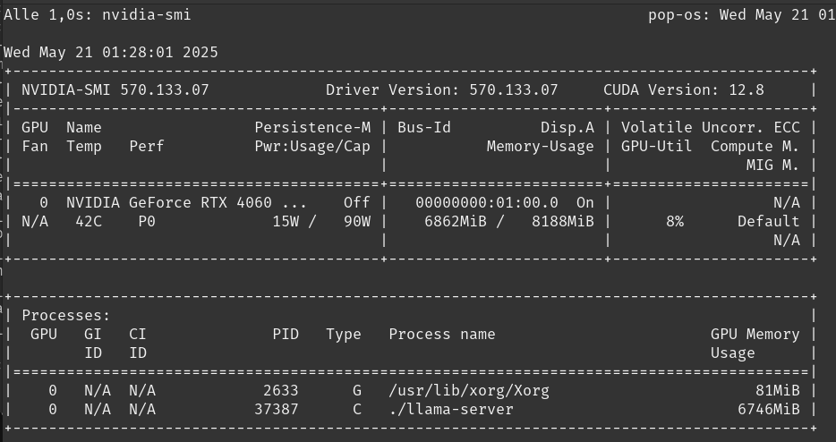

# llama.cpp-cuda-setup-popos

**A complete real-world setup guide for running [llama.cpp](https://github.com/ggerganov/llama.cpp) with CUDA support on Pop!_OS (RTX 4060). Includes troubleshooting, performance tips, and integration with SillyTavern.**
This project helped me switch to Linux after a Windows crash. Now I’ll never go back.


---

## Table of Contents

- [System Specs](#-system-specs-real-hardware)
- [Prerequisites](#-prerequisites)
- [Quick Start](#-quick-start)
- [Detailed Troubleshooting](#-detailed-troubleshooting)
- [Build Commands](#-working-build-commands)
- [Runtime Environment](#-runtime-environment-in-start_llama_serversh)
- [Memory Management](#-memory-management)
- [Model Used](#-model-used)
- [Testing the Server](#-testing-the-server)
- [SillyTavern Integration](#-sillytavern-integration)
- [Bonus: Custom Python CLI](#-bonus-custom-python-cli)
- [Suggested Directory Structure](#-suggested-structure)
- [Result](#-result)
- [Contributing](#-contributing)
- [License](#-license)

---

## 🛠️ System Specs (Real Hardware)

- **OS:** Pop!_OS 22.04 LTS (GNOME 42.9, X11)
- **GPU:** NVIDIA RTX 4060 Laptop GPU (8 GB VRAM)
- **CPU:** AMD Ryzen 7 8845HS (16 threads)
- **RAM:** 32 GB
- **CUDA:**
  - Runtime: 12.8 (`nvidia-smi`)
  - Toolkit: Initially 11.5, later toolchain adapted to 12.x
- **GPU Driver:** 570.133.07
- **Python:** 3.10 (in venv)

---

## Prerequisites

- Pop!_OS 22.04 (or compatible Ubuntu-based OS)
- NVIDIA drivers (tested with 570.133.07)
- CUDA Toolkit 12.x
- Python 3.10+
- CMake
- gcc-12 and g++-12

Install compilers if needed:
```bash
sudo apt install gcc-12 g++-12
```

---

## Quick Start

For experienced users, here’s the essential setup:

```bash
export PATH=/usr/local/cuda/bin:$PATH
export LD_LIBRARY_PATH=/usr/local/cuda/lib64:$LD_LIBRARY_PATH
export CUDA_HOME=/usr/local/cuda
export CUDACXX=/usr/local/cuda/bin/nvcc

cmake .. \
  -DLLAMA_CUDA=on \
  -DCMAKE_CUDA_COMPILER=/usr/local/cuda/bin/nvcc \
  -DCMAKE_C_COMPILER=/usr/bin/gcc-12 \
  -DCMAKE_CXX_COMPILER=/usr/bin/g++-12

make -j8
```

---

## 🧑‍🔧 Detailed Troubleshooting

### Problem 1: llama.cpp compiled without CUDA
- **Result:** All computation was done on CPU.
- **Fix:** Recompile with `-DLLAMA_CUDA=on`.

### Problem 2: CMake used wrong compiler (GCC 11)
- **Error:** `parameter packs not expanded with ‘...’`
- **Fix:** Use gcc-12/g++-12.

### Problem 3: CUDA `.cu` files compiled with `g++`
- **Fix:** Set `CUDACXX`:
  ```bash
  export CUDACXX=/usr/local/cuda/bin/nvcc
  ```

---

## Working Build Commands

```bash
export PATH=/usr/local/cuda/bin:$PATH
export LD_LIBRARY_PATH=/usr/local/cuda/lib64:$LD_LIBRARY_PATH
export CUDA_HOME=/usr/local/cuda

cmake .. \
  -DLLAMA_CUDA=on \
  -DCMAKE_CUDA_COMPILER=/usr/local/cuda/bin/nvcc \
  -DCMAKE_C_COMPILER=/usr/bin/gcc-12 \
  -DCMAKE_CXX_COMPILER=/usr/bin/g++-12

make -j8
```

---

## Runtime Environment (in `start_llama_server.sh`)

```bash
export PATH=/usr/local/cuda/bin:$PATH
export LD_LIBRARY_PATH=/usr/local/cuda/lib64:$LD_LIBRARY_PATH
export CUDA_HOME=/usr/local/cuda
export CUDACXX=/usr/local/cuda/bin/nvcc
```
➡️ These should be set in the shell script, not globally.

---

## Memory Management

### Problem: `cudaMalloc failed: out of memory`
- RTX 4060 (8 GB VRAM) cannot load all layers.

### Fix: Limit GPU layers
```bash
-ngl 20
```
Test incrementally (e.g., `-ngl 24`, etc.).

---

## Model Used

- `mythomax-l2-13b.Q5_K_M.gguf` from [TheBloke on Hugging Face](https://huggingface.co/TheBloke)
- Place in: `~/KI/modelle/`

---

## Testing the Server

```bash
curl http://localhost:11434/v1/completions \
  -H "Content-Type: application/json" \
  -d '{
    "model": "mythomax",
    "prompt": "Once upon a time...",
    "max_tokens": 100
  }'
```
➡️ Confirm GPU usage with `nvidia-smi`.

---

## SillyTavern Integration

### Problem: llama.cpp mode → no connection

### Fix:
- **API Type:** OpenAI
- **API Key:** Any dummy (`sk-test`)
- **API URL:** `http://localhost:11434/v1` (no `/completions` at end)
- **Model name:** `mythomax`

---

## Bonus: Custom Python CLI

File: `mythomax_terminal.py`  
Uses `llama-cpp-python` to prompt interactively from terminal with CUDA.

```python
llm = Llama(
    model_path=...,
    n_gpu_layers=20,
    n_ctx=2048,
    use_mlock=True
)
```

---

## Suggested Structure

```
KI/
├── llama-server/
│   └── llama.cpp/
│       └── build/
├── modelle/
│   └── mythomax-l2-13b.Q5_K_M.gguf
├── start_llama_server.sh
├── README.md
```

---

## Result

- Fully working llama.cpp server with GPU acceleration.
- API available locally for SillyTavern or curl.
- CUDA toolchain debugged and stable.
- No internet required.

---

### CPU acceleration with CUDA (llama-server on RTX 4060)

Once the server is running, you should see active GPU memory usage via `nvidia-smi`:




## Contributing

Contributions and suggestions are welcome! Please open an issue or submit a pull request.

---

## License

MIT – free to use, adapt, share.

---

Happy hacking! 🦠
